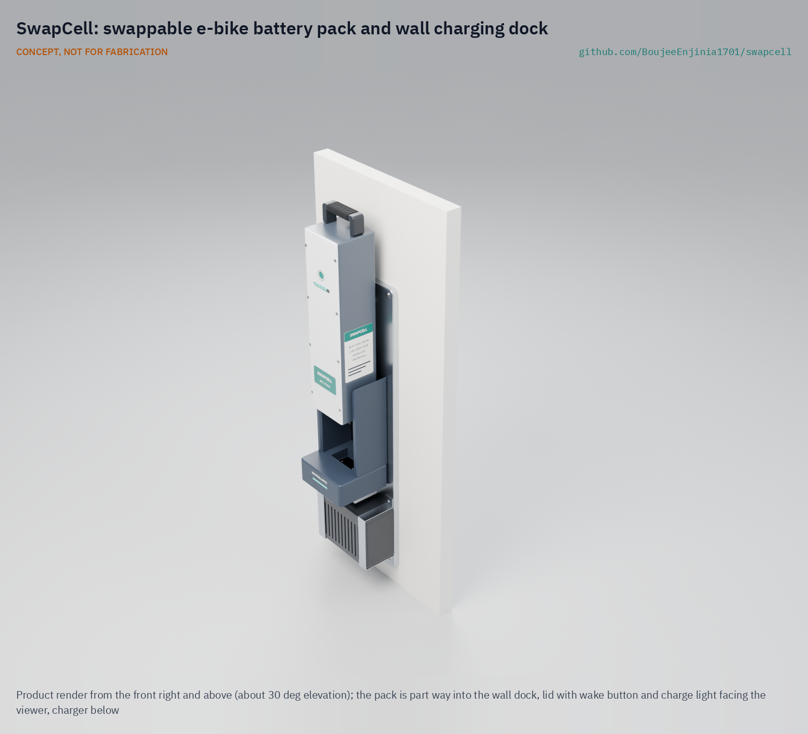
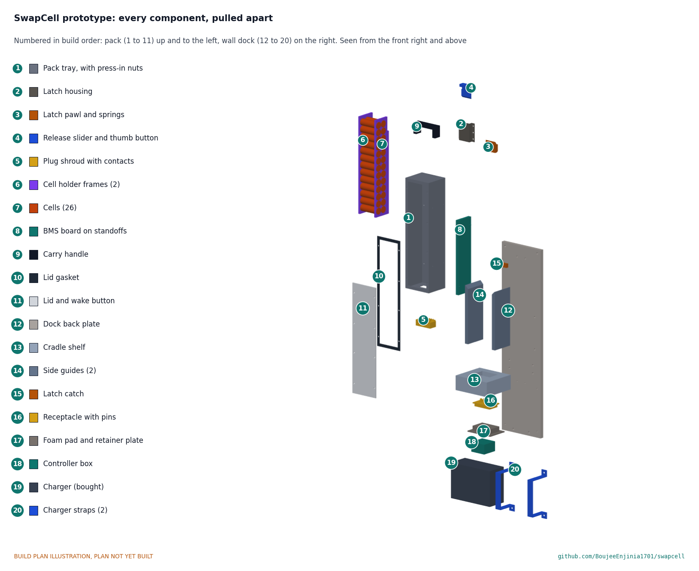

# SwapCell

     

**Area:** Mobility and Logistics · **TRL:** 3 of 9 (proof of concept on paper) · **Value-engineering target:** about $700 USD · **Difficulty:** 4 of 5

Open-standard swappable battery pack and wall dock for e-bikes, scooters and cargo trikes, with a defined connector, CAN-based BMS protocol and state-of-health logging.

[Exploded render](media/render-exploded.png) · [Detail render](media/render-detail.png) · [Interactive 3D model](media/viewer.html) · [Concept blueprint (PDF)](media/concept-blueprint.pdf) · [Prototype build plan](docs/05-build-plan.md) · [Design decisions](docs/06-design-decisions.md) · [Review note](docs/REVIEW.md)

## Concept rationale

The cells inside almost every e-bike, scooter and cargo-trike battery are the same commodity 18650 or 21700 cells; what locks a pack to one brand is its housing, connector and data protocol. SwapCell therefore puts the effort into a published interface (envelope, pinout, coded interlock and CAN message set) rather than into a better cell. Once the interface is open, any fleet, workshop or small builder can make a pack or a receiver that works with everyone else's, and the pack's state-of-health log travels with it instead of living in a brand's cloud.

The reference build uses parts a garage workshop can source and assemble: commodity cells, an open-source BMS, a folded aluminium tray, a printed lid and a certified off-the-shelf charger, so no custom mains electronics are needed. Keeping it open and buildable is what lets repair shops read and fix packs, and lets other open designs in this portfolio design around one battery instead of each inventing their own.

## Burning platform

Light electric vehicles are already the most electrified part of road transport: the IEA reports that about 8 % of the world's two- and three-wheelers were electric in 2023 and that electric models took 13 % of sales that year ([IEA, Global EV Outlook 2024](https://www.iea.org/reports/global-ev-outlook-2024/trends-in-other-light-duty-electric-vehicles)). In India, two-wheelers account for 70 to 80 % of all private vehicles ([NITI Aayog, draft Battery Swapping Policy, 2022](https://www.niti.gov.in/sites/default/files/2022-04/20220420_Battery_Swapping_Policy_Draft.pdf)), so how their batteries are charged, swapped and retired matters at national scale.

Closed, mismatched batteries are also a safety problem. In New York City, lithium-ion batteries caused 268 fires in 2023, killing 18 people and injuring 150 ([City of New York, 2024](https://www.nyc.gov/mayors-office/news/2024/07/mayor-adams-takes-new-actions-prevent-deadly-lithium-ion-battery-fires-promote-safe-e-bike)). A documented interface with a protected, dead-until-seated output and readable health data is one way to make safe, shared packs the easy choice.

## Where it could be used

### By industry

| Industry | Use |
| --- | --- |
| Last-mile delivery | Riders swap a flat pack for a charged one at a depot dock in seconds instead of waiting hours to charge |
| Bike and scooter sharing | One pack and dock family across mixed vehicle types, with state-of-health data to retire packs on evidence |
| Municipal, campus and industrial fleets | Shared packs for maintenance e-bikes, cargo trikes and site vehicles |
| Independent repair and refurbishment | Read a pack's log, find a weak cell group, repair it and return it to service |
| Agriculture and rural transport | Cargo trikes and e-bikes charged from a shared village dock or a small solar system |
| Off-grid energy | Retired or spare packs reused as storage in open power products such as PowerBox |

### By country or region

| Country or region | Why it matters there |
| --- | --- |
| India | About 880,000 electric two-wheelers and over 580,000 electric three-wheelers were sold in 2023 ([IEA](https://www.iea.org/reports/global-ev-outlook-2024/trends-in-other-light-duty-electric-vehicles)), and the government has proposed a battery swapping policy for these segments ([NITI Aayog](https://www.niti.gov.in/sites/default/files/2022-04/20220420_Battery_Swapping_Policy_Draft.pdf)) |
| China | Nearly 6 million electric two-wheelers were sold in 2023, the largest market in the world ([IEA](https://www.iea.org/reports/global-ev-outlook-2024/trends-in-other-light-duty-electric-vehicles)) |
| Kenya | Newly registered motorcycles, many used as boda-boda taxis, were estimated at 1.5 million in 2018 and could pass 5 million by 2030 ([UNEP](https://www.unep.org/news-and-stories/story/kenya-gets-breather-courtesy-electric-motorcycles)) |
| Viet Nam and Southeast Asia | Electric two-wheeler sales in Viet Nam were about 250,000 in 2023, and the electric share across ASEAN was only about 3 % ([IEA](https://www.iea.org/reports/global-ev-outlook-2024/trends-in-other-light-duty-electric-vehicles)), so shared packs could lower the entry cost |
| United States (New York City) | 268 lithium-ion battery fires and 18 deaths in 2023, and a city pilot of public battery charging for delivery workers ([City of New York](https://www.nyc.gov/mayors-office/news/2024/07/mayor-adams-takes-new-actions-prevent-deadly-lithium-ion-battery-fires-promote-safe-e-bike)) |

## What sparked the idea

The starting point was India's draft Battery Swapping Policy, published by NITI Aayog in April 2022 ([PDF](https://www.niti.gov.in/sites/default/files/2022-04/20220420_Battery_Swapping_Policy_Draft.pdf)). It asks for swappable batteries for two- and three-wheelers to be BMS-enabled, calls for standards for cables, connectors and repeated coupling tests, and favors open communication protocols so that batteries, vehicles and stations from different makers can work together. Those are the pieces of a common pack that no single brand has an incentive to publish. SwapCell takes that list literally and writes the interface down in the open: envelope, connector pinout with a coded interlock, CAN message set and health log, sized for e-bikes and cargo trikes.

## Problem

Every light electric vehicle brand uses its own battery, so fleets cannot share packs or chargers and batteries are scrapped early.

## Concept

Open-standard swappable battery pack and wall dock for e-bikes, scooters and cargo trikes, with a defined connector, CAN-based BMS protocol and state-of-health logging.

The core deliverable is the open **SwapCell interface v0.3**: envelope, blind-mate pinout with a coded interlock, CAN message set with a full bit layout, wake for hosts without CAN, a charge-while-discharging mode and a vehicle latch rating. Other portfolio designs build to it.

Full design precis: [docs/02-concept.md](docs/02-concept.md) · Sizing note: [docs/04-calcs/01-sizing.md](docs/04-calcs/01-sizing.md) · General arrangement: [cad/drawings/SWC-DWG-002.pdf](cad/drawings/SWC-DWG-002.pdf)

## Key components

- 26 x 21700 cells in 13S2P: 46.8 V, 10 Ah, about 468 Wh; pack about 3.0 kg
- Open-source BMS with CAN
- Folded aluminium tray with a printed flame-retardant lid
- Blind-mate power and signal connector with a coded interlock
- Certified 5 A dock charger
- Latch pawl rated for vehicle class V1
- ESP32 dock controller

The priced bill of materials is in [bom/bom.csv](bom/bom.csv). Value-engineering target: USD 700. Estimated cost of the constructable design: USD 606 for one pack and one dock (USD 94 under the target).

## Building the prototype

The [prototype build plan](docs/05-build-plan.md) (SWC-BLD-001) shows, in pictures, how to make each of the twenty components of one pack and one wall dock and put them together in seventeen steps; nothing has been built yet. The made parts are a folded aluminium tray, a steel latch with a thumb release, printed plug, receptacle, cell frames, handle, shelf and guides, and a 12 mm aluminium back plate; the cells, battery management board, contacts, charger and controller are bought. Writing the plan made the design buildable: the latch was redesigned so it actually holds the pack, the receptacle now floats, and every part has a fixing (SWC-DDR-003, open for Amish's review). Every picture is drawn from the model, which checks that each part touches what it should and clears what it should not; open questions are in the [design decisions register](docs/06-design-decisions.md).

## Safety

> Contains a 468 Wh lithium-ion battery pack at up to 54.6 V DC. Use a BMS with cell-level protection, fuse the pack, and charge on a non-combustible surface. Build and test packs only inside a fireproof enclosure, never unattended. This is a paper design at TRL 3; nothing here is certified.

## Repository layout

| Folder | Contents |
| --- | --- |
| `docs/` | Problem, concept, requirements, calculations and design decisions |
| `cad/src/` | build123d Python source, the source of truth for all geometry |
| `cad/step/`, `cad/stl/` | Exported models for FreeCAD, other CAD tools and printing |
| `cad/drawings/` | 2D sketches and dimensioned drawings |
| `bom/` | Bill of materials |
| `electronics/` | KiCad schematics and PCB layouts |
| `firmware/` | Microcontroller code |
| `media/` | Renders, perspectives and photos |
| `build-log/` | Dated prototyping notes |

## Documentation

Controlled documents follow the portfolio [documentation standard](.kit/STANDARDS.md). Each carries a document ID (SWC-PRC-001 for the precis), a version and a revision history. Branded PDFs are built with `python .kit/render.py` and attached to GitHub Releases when a document is tagged, for example `SWC-PRC-001/v1.0`.

## Credits

Designed by Amish Chadha. See [CONTRIBUTORS.md](CONTRIBUTORS.md) for roles. To cite this design, use [CITATION.cff](CITATION.cff) (GitHub shows it as "Cite this repository").

AI assistance (Claude) was used to accelerate concept renders, prototype documentation and first-pass sizing calculations. Design direction and all decisions are Amish Chadha's, recorded in this repository's decision records (`docs/decisions/`).

## Licenses

- **Hardware** (CAD, drawings, BOM, electronics): [CERN-OHL-S v2](LICENSE)
- **Software** (firmware, scripts, notebooks): [MIT](LICENSE-SOFTWARE)

A project of the [Design Molecule](https://designmolecule.com) lab.
