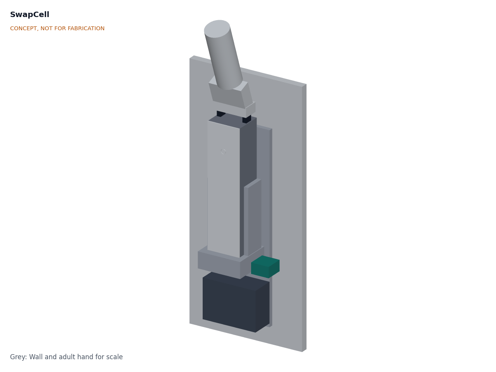
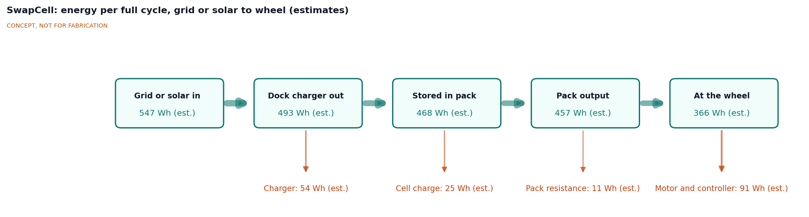
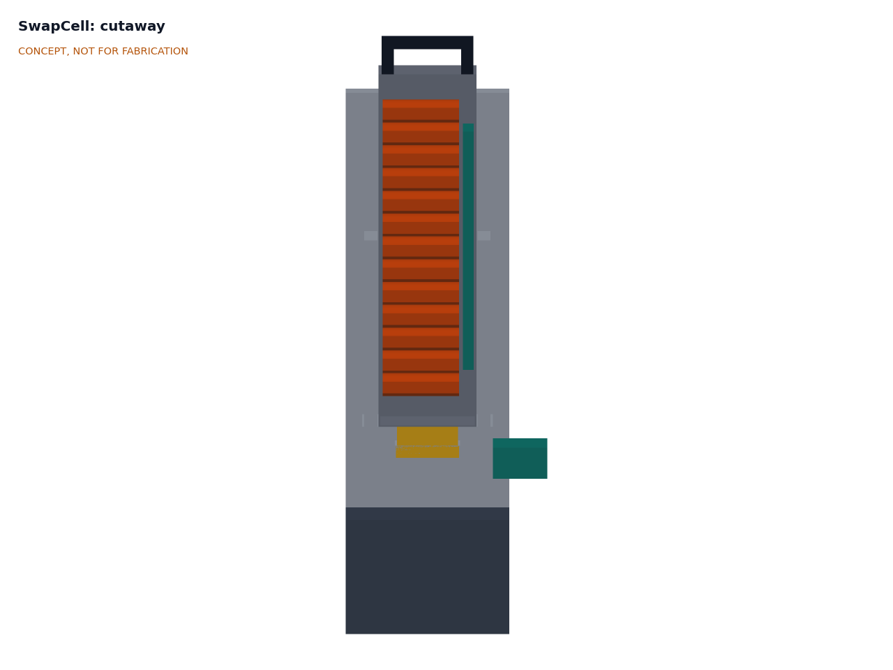
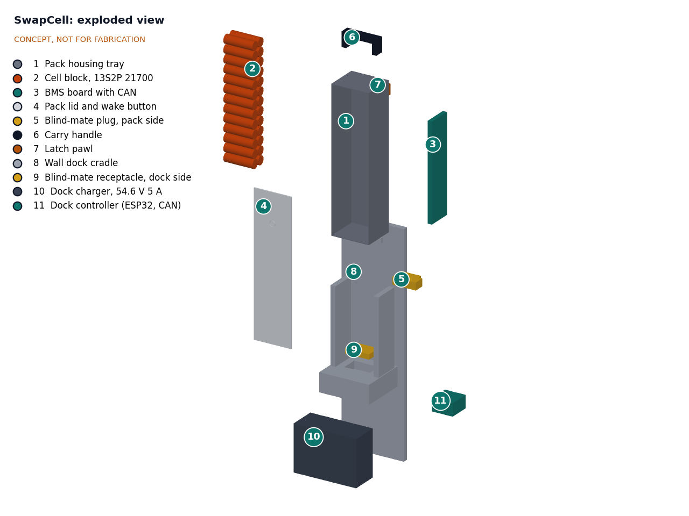

# SwapCell design precis

SwapCell is a 48 V, 10 Ah lithium-ion pack of 26 cells in a 340 x 90 x 80 mm body that drops, connector first, into a wall dock or a vehicle mount, mates through a floating blind-mate connector, and talks to whatever it is plugged into over CAN. The pack carries its own state-of-health log, so any dock can read its history. The sizing note SWC-CAL-001 confirms that the 13S2P pack of 21700 cells gives about 468 Wh at about 2.85 kg, charges in about 2.3 h on a 5 A dock, and costs about $414 in prototype parts, with the dock adding about $145. Two requirements remain at risk: cell temperature at 20 A in an enclosed mount (R3) and cycle life (R9).

The interface (envelope, pinout and message set) is the core deliverable of this precis. This version issues **SwapCell interface v0.3**, which adds three items Amish approved on 2026-09-25: a wake method for hosts without CAN or a wake supply (item W), a charge-while-discharging mode (item C) and a latch vibration rating for vehicles (item V). PowerBox, SunSpoke, StepGen, WaterWalker, CargoMule, FieldCell and other designs build to it.

*Figure 1. Pack seated in the wall dock, with a hand on the carry handle for scale. Rendered from the parametric model `cad/src/model.py`.*

## How it works

1. **Dock.** The pack hangs connector end down in a wall cradle. Side guides bring it within the connector's capture range, gravity seats it, and a spring latch on the back face clicks into a catch on the cradle.
2. **Mate and wake.** The blind-mate connector makes contact in sequence: ground first, then power and CAN, and a short interlock pin last. The receiver's 10 kΩ coding resistor in the INTERLOCK loop wakes a sleeping pack without any supply from the host. Until the pack has checked that loop, the output is dead.
3. **Handshake.** The dock controller (ESP32 with a CAN transceiver) sends a heartbeat. The pack answers with its identity, limits and state of health. If the pack reports no fault and a charge limit of at least 5 A, the dock switches its certified 54.6 V, 5 A charger onto the pack.
4. **Charge and log.** The BMS balances cells, limits charge by temperature and records each cycle. The dock copies new cycle records to its SD card and exports them as CSV.
5. **Swap.** The rider lifts the pack by the handle, releases the latch with the same hand, and slides it into the vehicle mount, which mirrors the dock cradle and closes an over-centre lever to hold the pack against vibration (latch class V1). The vehicle controller runs the same handshake, and the pack enables its output. A vehicle without CAN gets legacy discharge-only output at 15 A.
6. **Charge while in use.** A station host such as PowerBox, or a vehicle that recovers energy, requests the charge-discharge mode and may push current into the pack while drawing from it, within the limits the pack publishes.

*Figure 2. Energy per full charge and discharge, grid or solar to wheel. All values are estimates from SWC-CAL-001.*

## Main components

| # | Component | Proposed choice | Notes |
| --- | --- | --- | --- |
| 1 | Pack housing tray | Folded 1.5 mm 5052 aluminium, open front, flame-retardant liner, riveted latch doubler | Carries the latch and handle loads; spreads heat. Decided by Amish, 2026-09-25 |
| 2 | Cell block | 26 x 21700 cells, 13S2P, 5.0 Ah nominal (4.85 Ah minimum) and 3.6 V each, 25 A continuous rating | Cells in holders with fuse-wire links. Decided by Amish, 2026-09-25 |
| 3 | BMS board | Open-source 13S BMS with CAN, balancing, 30 A continuous FETs, pre-charge, flash log, 100 µA sleep with INTERLOCK wake | Stands beside the cells on its long edge |
| 4 | Pack lid | Flame-retardant polymer (UL 94 V-0 grade), gasketed, flush sealed wake button | Removable for repair |
| 5 | Blind-mate plug, pack side | 2 power contacts (40 A) plus 6 potted signal contacts in a keyed shroud | Fixed to the pack; family proposed, awaiting Amish |
| 6 | Carry handle | Moulded loop over the top end, 25 mm grip clearance | Sized for a gloved hand |
| 7 | Latch pawl | Spring-loaded steel pawl on the back face, thumb release under the handle, 1.72 kN proof load | Same catch geometry on dock and vehicle |
| 8 | Wall dock cradle | Back plate, cradle shelf with connector pocket, side guides and latch catch | Wall-mounted at 0.8 to 1.2 m |
| 9 | Blind-mate receptacle, dock side | Mating half on a floating mount (±3 mm, ±2°), 10 kΩ INTERLOCK coding resistor | Replaceable wear part |
| 10 | Dock charger | Certified 54.6 V, 5 A CC-CV lithium-ion charger, settable to 53.3 V for fleet mode | Off-the-shelf; no custom mains electronics. Decided by Amish, 2026-09-25 |
| 11 | Dock controller | ESP32 with CAN transceiver, charger relay, current sensor and SD card | Runs the handshake and exports logs |

Items 12 (fuses, pre-charge and wiring), 13 (seals, foam and fasteners) and 14 (wake button and label) are in the BOM but not modelled. Numbers match `bom/bom.csv` and Figure 4. The general arrangement is drawing SWC-DWG-002 (`cad/drawings/SWC-DWG-002.pdf`), generated from `cad/src/model.py`.

## Key numbers

All values come from SWC-CAL-001 (`docs/04-calcs/sizing.py`) and are paper estimates. Cell assumptions: 5.0 Ah nominal and 4.85 Ah minimum, 3.6 V nominal, 3.0 to 4.2 V, about 69 g, about 12 mΩ DC internal resistance, 25 A continuous, about $5.50 in small quantity.

| Quantity | Value | Basis | Requirement |
| --- | --- | --- | --- |
| Configuration | 13S2P, 26 cells | Decided by Amish, 2026-09-25 | |
| Voltage | 46.8 V nominal, 39.0 to 54.6 V | 13 x 3.6 V; 13 x 3.0 to 4.2 V | R1 met |
| Capacity and energy | 10.0 Ah and about 466 Wh at 0.2C; 9.7 Ah and 452 Wh at cell minimum | 2 x 5.0 Ah less sag | R2 **at risk** at cell minimum |
| Pack resistance | about 110 mΩ | 13 groups x 6 mΩ, plus 32 mΩ for links, fuse wires, FETs, shunt and connector | |
| Cell current | 10 A continuous, 17.5 A peak | 20 A and 35 A over 2 cells; rated 25 A | R3 electrically met |
| Cell hot spot, 20 A full discharge | about 51 °C in open air, 63 °C enclosed, 71 °C from 45 °C ambient | Lumped model, UA 1.17 W/K, τ 32 min | R3 **at risk** |
| Heat at 10 A (typical e-bike) | about 11 W | I²R | |
| Voltage sag | about 2.2 V at 20 A, 3.9 V at 35 A | I x 110 mΩ | |
| Mass | about 2.85 kg (6.3 lb) | Cells 1.79 kg, tray 0.40, lid 0.11, interconnects 0.18, BMS 0.12, plug 0.06, handle and latch 0.10, seals and button 0.08 | R5 met |
| Body and overall size | 340 x 90 x 80 mm; 393 mm with handle and plug | Parametric model | R6 met |
| Energy density | about 164 Wh/kg, about 191 Wh/L | 468 Wh over 2.85 kg and 2.45 L | |
| Charge time at 5 A | about 2.3 h to full; 1.6 h to 80 %; 1.2 h for 20 to 80 % | CC to 85 % in 1.7 h, then about 0.6 h CV | R4 met |
| Dock input power | about 303 W in CC | 54.6 V x 5 A at 90 % | |
| Energy per cycle | about 547 Wh from grid or solar, about 457 Wh at the pack terminals | Figure 2 | |
| Range | about 38 to 57 km (e-bike), 18 to 30 km (loaded cargo trike) | 457 Wh at 12 to 8 Wh/km and 25 to 15 Wh/km | |
| Cell cost | about $143, $0.31/Wh | 26 x $5.50 | |
| Parts cost | about $414 per pack, $145 per dock, $559 total | `bom/bom.csv` | R16 met ($700) |
| Cycle life | about 300 to 500 cycles to 80 % | Typical for the cell class; higher in 4.1 V fleet mode | R9 **at risk** |
| Sleep drain | about 0.72 % per month at 100 µA | Interface v0.3 item W | R13 met on paper |
| CAN bus load | about 1.8 % (one pack), 3.1 % (two packs) | 34.1 frames/s at 135 bits | R12 met on paper |

*Figure 3. Section through the docked pack: cells (2) with their axes across the width, BMS board (3) beside them, plug (5) in the dock receptacle (9).*

## Interface definition

This section is the **SwapCell interface, version 0.3** (draft, 2026-09-25). Amish approved v0.2 as written and the three v0.3 additions on 2026-09-25 (SWC-DDR-001). The specific values inside the additions (marked †) are engineering proposals awaiting his confirmation. Other portfolio designs build to this section, cite it as "SwapCell interface v0.3", and flag any conflict to this repo rather than change it locally. Changes need Amish's approval.

*Table 1. Changes from v0.2.*

| Item | Change | Why | Requirement |
| --- | --- | --- | --- |
| W | Wake on a coded INTERLOCK loop (10 kن to SGND in every receiver), plus a manual wake button; WAKE pin kept but optional | Battery-only and non-CAN hosts (PowerBox, legacy vehicles) have no wake supply | R13 |
| C | Requested mode 4, charge-discharge; host type 3, station; host charge limit in HOST_HEARTBEAT | PowerBox runs loads while charging from solar; vehicles may recover energy | R14 |
| V | Latch classes: D (gravity dock) and V1 (vehicle), with a proof load, preload and vibration profile | Vehicles shake; v0.2 had only a 3 g placeholder | R15 |
| L | Full CAN bit layout (Table 3) and interface version in PACK_STATUS | TRL 3 work listed in the TRL 2 review | R12 |

### Mechanical envelope

| Feature | Value | Notes |
| --- | --- | --- |
| Body | 340 x 90 x 80 mm, +0 / -1.5 mm | Length along the insertion axis |
| Datum | Connector face (pack underside); insertion along the long axis, connector first | Same in dock and vehicle mount |
| Connector position | Centred across the 90 mm width, 8 mm toward the back face from the depth centre line | Keeps the plug clear of the lid seam |
| Guide faces | The two 340 x 80 mm side faces, 90 mm apart | Receiver guides with 1 mm clearance per side and a 10 mm lead-in |
| Latch | Pawl on the back face, 45 mm below the top end, 36 mm wide, 4 mm tooth; engages a catch on the receiver | Proof load 1.72 kN† along the insertion axis |
| Handle zone | Up to 35 mm above the top end, 84 x 22 mm footprint | Receivers leave this zone clear |
| Wake button | Flush in the lid (front) face, 12 mm, 70 mm below the top end | New in v0.3; inside the envelope |
| Orientation | Any; the latch, not gravity, retains the pack in a vehicle | Dock uses gravity to seat |
| Mass limit for receivers | 3.5 kg pack | R5 |
| Airflow | Vehicle receivers leave the back and lid faces open to air where possible | R3 is at risk in an enclosed mount |

**Latch classes (item V).** *Class D* (gravity dock): the pack seats under its own weight; the latch only stops it being knocked out. *Class V1* (vehicle): the receiver and the pack latch together hold the pack with no latch release and no power-contact interruption of 1 ms or longer under the sinusoidal vibration profile of UN 38.3 test T3 (7 to 200 Hz, peak 8 g, three axes) and 25 g†, 11 ms half-sine shocks, three in each direction on each axis. The receiver preloads the pack against its end stop with at least 330 N† through an over-centre lever (ratio 6.6 or more, hand force 50 N or less), so the contacts do not chatter at 8 g; the lever has a detent so it cannot open under vibration. The pack latch withstands a static 1.72 kN proof load along the insertion axis without permanent set. Verification is by test at TRL 4, which is on hold.

### Connector pinout

Two power contacts and six signal contacts in a keyed shroud that only mates one way round. Mating order is set by contact length.

| Pin | Signal | Rating | Mates | Function |
| --- | --- | --- | --- | --- |
| P1 | PACK+ | 40 A continuous | 2nd | Pack positive, behind the BMS FETs; dead until enabled |
| P2 | PACK- | 40 A continuous | 1st | Pack negative |
| S1 | SGND | 1 A | 1st | Signal ground and CAN reference, joined to PACK- inside the pack |
| S2 | CAN_H | Signal | 2nd | CAN 2.0B, 250 kbit/s; 120 Ω termination in the host, not the pack |
| S3 | CAN_L | Signal | 2nd | As above |
| S4 | WAKE | 5 to 15 V, 10 mA | 2nd | Optional in v0.3. A host may drive it high to wake the BMS or hold it awake |
| S5 | AUX | 12 V, 1 A (reserved) | 2nd | Proposed low-power output for lights or a dock display; off by default |
| S6 | INTERLOCK | Signal, 3.3 V, 30 µA | 3rd (last) | **v0.3:** loops to SGND through a 10 kΩ† ±1 % coding resistor in every receiver. The pack accepts 8.0 to 12.5 kΩ (node 0.24 to 0.37 V); a short, an open loop or any other value keeps the output dead. It is also the wake source (item W) |

### Wake and sleep (item W)

In sleep the BMS draws 100 µA† or less and holds INTERLOCK at 3.3 V through 100 kΩ, with a comparator armed. The pack wakes on any of: INTERLOCK falling below 1.0 V, WAKE driven high, the manual button, or (optionally) CAN activity. Awake, it measures the INTERLOCK resistance. If the loop is valid, it goes to standby and waits for a heartbeat; if not, it sets a warning, keeps the output dead and sleeps again after 60 s, re-arming only when the node returns high, so a coin or water across the contacts cannot hold it awake. With no heartbeat, no current and a valid loop, the pack sleeps after 10 min unless a host holds WAKE high or sets the keep-awake flag. A host without CAN (legacy mode) therefore needs nothing but the coding resistor.

### CAN message set

CAN 2.0B controllers at 250 kbit/s, 11-bit identifiers. Each pack has a node number n from 0 to 7 (default 0) so a vehicle can carry two packs; identifiers below are base values plus n. All signals are little-endian unsigned integers unless marked signed. Current is positive out of the pack.

*Table 2. Messages.*

| ID (base) | Message | Direction | Rate |
| --- | --- | --- | --- |
| 0x100 | PACK_STATUS | Pack to host | 10 Hz |
| 0x110 | PACK_LIMITS | Pack to host | 10 Hz |
| 0x120 | CELL_SUMMARY | Pack to host | 1 Hz |
| 0x130 | TEMPERATURES | Pack to host | 1 Hz |
| 0x140 | FAULTS | Pack to host | On change and 1 Hz |
| 0x150 | STATE_OF_HEALTH | Pack to host | 0.1 Hz |
| 0x160 | IDENTITY | Pack to host | On request (remote frame or HOST_HEARTBEAT flag) |
| 0x180 | HOST_HEARTBEAT | Host to pack | 10 Hz |
| 0x190 | CHARGER_STATUS | Dock or station to pack | 1 Hz |
| 0x1F0 / 0x1F8 | LOG_REQUEST / LOG_DATA | Dock to pack / pack to dock | On request; segmented transfer in the style of ISO 15765-2 |

*Table 3. Bit layout (8 data bytes per frame; byte 0 first).*

| Message | Bytes | Signal | Scale and range |
| --- | --- | --- | --- |
| PACK_STATUS | 0 to 1 | Pack voltage | 10 mV, 0 to 655.35 V |
| | 2 to 3 | Pack current, signed | 100 mA, ±3,276.7 A |
| | 4 | State of charge | 0.5 %, 0 to 100 % |
| | 5 | State | 0 sleep, 1 standby, 2 discharge, 3 charge, 4 charge-discharge, 5 legacy discharge, 6 fault |
| | 6 | Flags | bit 0 INTERLOCK valid, 1 heartbeat valid, 2 discharge FET on, 3 charge FET on, 4 pre-charge active, 5 to 6 wake source (0 INTERLOCK, 1 WAKE, 2 button, 3 CAN), 7 fleet mode |
| | 7 | Counter and version | bits 0 to 3 rolling counter, bits 4 to 7 interface minor version (3 for v0.3) |
| PACK_LIMITS | 0 to 1 | Allowed discharge current | 0.1 A |
| | 2 to 3 | Allowed charge current | 0.1 A; 0 below 0 °C and above 45 °C cell temperature |
| | 4 to 5 | Maximum charge voltage | 10 mV (54.60 V standard, 53.30 V fleet) |
| | 6 to 7 | Minimum pack voltage | 10 mV |
| CELL_SUMMARY | 0 to 1, 2 | Minimum cell voltage, group index | 1 mV; 0 to 12 |
| | 3 to 4, 5 | Maximum cell voltage, group index | 1 mV; 0 to 12 |
| | 6 to 7 | Imbalance | 1 mV |
| TEMPERATURES | 0, 1 | Minimum and maximum cell temperature, signed | 1 °C |
| | 2, 3 | FET and connector temperature, signed | 1 °C |
| | 4, 5 | Sensor index of minimum and maximum | 0 to 255 |
| | 6 to 7 | Reserved | 0 |
| FAULTS | 0 to 3 | Fault bits | 0 cell overvoltage, 1 cell undervoltage, 2 discharge overcurrent, 3 charge overcurrent, 4 short circuit, 5 over-temperature, 6 under-temperature charge, 7 INTERLOCK invalid, 8 heartbeat lost, 9 pre-charge failed, 10 FET failure, 11 cell imbalance, 12 isolation or water ingress, 13 to 31 reserved |
| | 4 to 5 | Warning bits | Same order as faults, early warning thresholds |
| | 6 | Seconds until disconnect | 1 s; 255 = none pending |
| | 7 | Rolling counter | 0 to 255 |
| STATE_OF_HEALTH | 0 | SoH | 0.5 % |
| | 1 to 2 | Full-charge capacity | 10 mAh |
| | 3 to 4 | Cycle count | 1 |
| | 5 to 6 | Lifetime throughput | 10 Ah |
| | 7 | Resistance estimate | 1 mΩ, 0 to 255 |
| IDENTITY | 0 | Page | 0 to 3 |
| | 1 to 7 | Page 0: interface major and minor, chemistry code, series count, parallel count, rated capacity (0.1 Ah, 2 bytes); pages 1 and 2: serial number (14 ASCII bytes); page 3: firmware version | |
| HOST_HEARTBEAT | 0 | Host type | 0 vehicle, 1 dock, 2 tester, 3 station (new in v0.3) |
| | 1 | Requested mode | 0 sleep, 1 standby, 2 discharge, 3 charge, 4 charge-discharge (new in v0.3) |
| | 2 to 3 | Host discharge current limit | 0.1 A |
| | 4 to 5 | Host charge current limit | 0.1 A (new in v0.3) |
| | 6 | Flags | bit 0 fleet mode, 1 keep awake, 2 request IDENTITY, 3 to 7 reserved |
| | 7 | Rolling counter | 0 to 255 |
| CHARGER_STATUS | 0 to 1, 2 to 3 | Charger voltage and current capability | 10 mV, 0.1 A |
| | 4 to 5, 6 to 7 | Measured output voltage and current | 10 mV, 0.1 A |

### Behavior rules

- **Enable.** The pack enables any output only with a valid INTERLOCK loop. Discharge needs a heartbeat requesting mode 2 or 4; charge needs a heartbeat from a dock, station or vehicle requesting mode 3 or 4. A heartbeat is valid while its counter advances at least every 300 ms.
- **Legacy mode (decided).** If INTERLOCK is valid and no heartbeat arrives within 2 s, the pack enables discharge only, limited to 15 A, and never charges or enters mode 4.
- **Charge-discharge mode (item C).** In mode 4 both FETs are on and current may flow either way. The host keeps net charge current at or below the lower of its own charge limit and the pack's allowed charge current, and the pack terminal voltage at or below the maximum charge voltage. The pack enforces its limits: on a charge-side fault (charge overcurrent, a cell near overvoltage, or cell temperature below 0 °C or above 45 °C) it sets allowed charge current to zero, warns, and after 1 s opens only the charge FET, so discharge continues through that FET's body diode and the load stays powered. Mode changes between 2, 3 and 4 never open the output.
- **Warn, then derate.** For a non-fatal fault the pack first warns and ramps its current limit down over about 5 s, so a rider is not left without power mid-junction. It opens immediately only for short circuit, cell overvoltage or over-temperature beyond the hard limit.
- **Removal.** When INTERLOCK opens (it breaks first on removal), the pack opens its output within 1 ms, before the power contacts separate.

**State-of-health log.** One 32-byte record per charge or discharge event: dock timestamp, Ah in and out, minimum and maximum temperature, peak current, minimum cell voltage, capacity and resistance estimates. 2,000 records need 64,000 bytes, which fits in the BMS microcontroller flash or a small SPI flash and transfers in about 10 s (R12).

**EnergyBus gateway.** Decided: an open SwapCell profile now, with a gateway study. The study is not complete. A gateway (an ESP32 translating between the two message sets) looks feasible in principle, since both carry voltage, current, limits and state, but a message-by-message mapping needs the CiA 454 specification, which is distributed through a membership organization and was not read for this version.

## Key design choices

All of these were decided by Amish on 2026-09-25 (go with recommendation), SWC-DDR-001, unless marked otherwise.

- **13S2P of 5 Ah 21700 cells.** Meets 10 Ah with 26 cells and 52 welds. A 13S4P "double" pack (about 900 Wh, about 5 kg) is a later variant in a longer envelope.
- **Aluminium tray with a printed flame-retardant lid.** Metal spreads heat, resists a cell fire longer than a printed shell and carries the 1.72 kN latch proof load through a riveted doubler.
- **Floating blind-mate connector with a dead pack output and a coded interlock.** Sequenced contacts and a last-mate, resistor-coded interlock keep the output off until the pack is seated in a real receiver, avoid arcing on insertion and let a receiver wake the pack.
- **Own open message set, with an EnergyBus gateway study.** Short, published and easy to implement on an ESP32 or a hobby controller.
- **Legacy mode for vehicles without CAN.** Discharge only, fixed at 15 A.
- **The log lives in the pack.** Any dock, anywhere, can read a pack's history without a shared server.
- **Certified charger, switched by the dock.** The dock builds no mains electronics; charge current is fixed at 5 A.
- **Fleet charge mode.** The dock may set 4.1 V per cell (53.3 V) for longer life at about 10 % less energy.
- **Interface governance.** This section is the versioned interface; Amish approves changes.
- **Solar DC dock variant.** A second dock with a 48 V DC input (via PowerBox) follows the mains dock; not designed at TRL 3.
- **Connector family (proposed, awaiting Amish).** Options: a commercial blind-mate power and signal connector, or a custom printed keyed shroud around commercial high-current socket contacts and potted spring signal contacts. Recommendation: the custom shroud for the prototype, because it keeps the published geometry independent of one vendor; the contacts are bought and replaceable. R8 and R10 depend on this choice.

*Figure 4. Exploded view with callouts numbered as in the components table and `bom/bom.csv`.*

## Safety

> **Safety:** SwapCell is a 468 Wh lithium-ion pack. A cell in thermal runaway vents flammable, toxic gas and can ignite its neighbours; a pack fire is hard to extinguish and can re-ignite hours later. Treat every pack as a fire hazard at all stages.

- **Thermal runaway.** Use new cells from a reputable distributor, with matched capacity and resistance. Space cells in holders (about 1 mm gaps) and consider a mica or intumescent barrier between groups; line the tray with a flame-retardant sheet; give the housing a vent path that directs gas away from the handle and the user. Propagation resistance was not analyzed at TRL 3 and can only be shown by test, which is TRL 4 work and on hold.
- **Cell-level fusing.** Each cell connects to its bus through a fuse wire or fusible link sized to carry 17.5 A peak without damage but to open on the fault current of an internally shorted neighbour. A 40 A main fuse sits in series with PACK+.
- **BMS protections (R11).** Cell overvoltage and undervoltage, charge and discharge overcurrent, short-circuit trip within 500 µs, over-temperature, no charging below 0 °C, pre-charge of the host's input capacitors, and an output that stays off until the interlock closes. Exposed pack contacts are at up to 54.6 V DC and can deliver hundreds of amperes into a short, so the dead-output rule is a safety requirement, not a convenience.
- **Coded interlock (v0.3).** A bare link or a coin across INTERLOCK and SGND reads as a short and never enables the output, even in legacy mode. Receivers must fit the 10 kΩ coding resistor; a receiver that shorts the loop simply does not work, which fails safe.
- **Charge-discharge mode (v0.3).** A host that pushes current into a pack is a charger. The pack refuses charge below 0 °C and above 45 °C and opens only its charge FET on a charge-side fault, so the load stays powered and the cells are protected. Hosts must still limit their own charge current and voltage.
- **Pack retention in vehicles (v0.3).** A pack that leaves its mount at speed is a 2.85 kg projectile with live contacts. Vehicle receivers must meet latch class V1, with an over-centre lever that cannot open under vibration.
- **Loss of power while riding.** A pack that cuts out suddenly can cause a fall. The warn-then-derate rule in the message set applies to every fault except the hard ones.
- **Dock location.** Mount docks on a non-combustible wall, away from exits and escape routes, with a smoke alarm nearby. Do not charge packs that have been dropped, crushed or wetted until they have been inspected.
- **Transport rules.** At about 468 Wh the pack is well above 100 Wh, so it ships as Class 9 dangerous goods (UN 3480 alone, UN 3481 in or with equipment), needs a UN 38.3 test summary before commercial shipping, cannot travel in passenger air baggage, and by air generally has to ship at 30 % state of charge or less. Moving prototype packs by road between workshops still needs terminal protection and a rigid, non-conductive container.
- **Building and testing.** Build, charge and test prototype packs only inside a fireproof enclosure (a steel cabinet or a purpose-made battery containment box) on a non-combustible surface, with a Class D or lithium-rated extinguisher and a sand bucket at hand, and never unattended. Use insulated tools, cover exposed bus bars, and build the pack one series group at a time with the BMS disconnected until wiring is checked.
- **Standards.** EN 50604-1 and UL 2271 (light-vehicle batteries), UL 2849 (e-bike electrical systems) and IEC 62133-2 are future compliance targets. Nothing here is certified.

## Open questions

Items that remain open after SWC-DDR-001. None of them is TRL 4 work to be started now; TRL 4 is on hold by Amish's instruction.

- **R3 thermal rating.** Keep 20 A continuous at 25 °C with temperature derating in PACK_LIMITS (recommended), or label the pack 15 A continuous? About 14 A holds 60 °C from 45 °C ambient. Proposed, awaiting Amish.
- **Cell model (R9).** Which 5 Ah 21700 cell balances cycle life against current rating needs datasheet review against named cells; R9 stays at risk until then.
- **LFP variant.** A 16S LFP pack (about 51 V nominal, up to 58.4 V) would be safer and longer lived but heavier. PACK_LIMITS already allows a different voltage window. No preference stated; awaiting Amish.
- **Connector family.** Recommendation above; proposed, awaiting Amish.
- **Values inside items W, C and V** (marked †): proposed, awaiting Amish's confirmation.
- **EnergyBus mapping.** Needs the CiA 454 specification.
- **First co-design partner.** Left open; the portfolio picks partners per area later.

Concept media: [blueprint sheet](../media/concept-blueprint.pdf), [interactive 3D model](../media/viewer.html).
